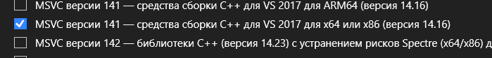
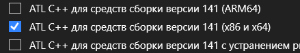
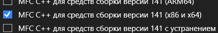
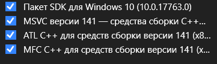

# Гайд как это дело запустить
Чтобы оно вообще запустилось, нужно в Visual Studio Installer->Изменение->Отдельные компоненты добавить несколько библиотек. По идее их можно добавлять для вижлы 2019 года (v142 Build Tools), но лично у меня не получилось. Поэтому пришлось установить v141 для 2017 вижлы и потом библиотеки для этой же версии.  
***
Build Tools Visual Studio 2017:  
  
***
Нужные библиотеки:  
  
***
  
***
По итогу получился такой набор:  
  